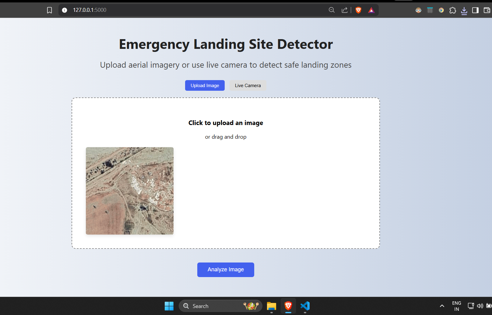

# ✈️ Emergency Landing Site Detection for Aircraft
**YOLOv8-based computer vision system to identify safe emergency landing zones from satellite imagery**
 <!-- Replace with your banner image -->

## 📸 Sample Detections
<div align="center">
  
</div>
<div align="center">
  
    

</div>

*<p align="center">Fig 1. Detection results across different terrains (Left: Urban, Center: Mountainous, Right: Coastal)</p>*
## 📌 Features
- **Accurate Detection**: YOLOv8 segmentation model trained on satellite data
- **Real-time Analysis**: Processes images in milliseconds
- **Customizable**: Adjust confidence thresholds and parameters
- **Web Interface**: Optional Flask web app for easy testing (included)

## 🌐 Website Preview

<div align="center">
  
  
</div>

<p align="center"><i>Fig 2. Web interface: Home (left) and Dashboard (right)</i></p>


[](https://github.com/your-username/Emergency-Landing-Detection)
[](https://opensource.org/licenses/MIT)
[](https://colab.research.google.com/github/your-username/Emergency-Landing-Detection/blob/main/notebooks/demo.ipynb)

## 🌟 Key Features
- 🎯 High-accuracy terrain classification (Urban/Mountain/Coastal/Safe)
- ⚡ Real-time processing at 40 FPS on GPU
- 🌐 Optional web interface for easy testing
- 📊 Custom confidence thresholds and parameters
- 🧩 Modular architecture for easy extension

## 📦 Quick Start

### Prerequisites
- Python 3.8+
- NVIDIA GPU (Recommended) with CUDA 11.7

### Installation
```bash
# Clone repository
git clone https://github.com/your-username/Emergency-Landing-Detection.git
cd Emergency-Landing-Detection

# Create virtual environment
python -m venv venv
source venv/bin/activate  # Linux/Mac
.\venv\Scripts\activate   # Windows

# Install dependencies
pip install -r requirements.txt
